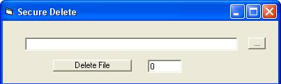



## Secure File Delete \[The Laughing Man\]

### Description

This is a program that will securely erase a file. This program was coded so that it can be copied into a module without needing to make modification. this method of mine works by randomly generating a random character then overwriting every character in the file with it, Then on the next pass over use a new character.

This program will let the user pick how many passes to make on the file as well. The code is commented but please let me know if you have further questions. Also this is my first upload, please let me know what you think and Enjoy!!!
 
### More Info
 
the function will require two things

1) the path to the file.

2) the number of times you would like it to be overwritten.

If you use this on a file, It will be gone and if recover it will be garbage data, please be careful

             |
---                |---
**Submitted On**   |2007-11-12 04:54:40
**By**             |[The Laughing Man](https://github.com/Planet-Source-Code/PSCIndex/blob/master/ByAuthor/the-laughing-man.md)
**Level**          |Intermediate
**User Rating**    |4.3 (13 globes from 3 users)
**Compatibility**  |VB 5\.0, VB 6\.0
**Category**       |[Files/ File Controls/ Input/ Output](https://github.com/Planet-Source-Code/PSCIndex/blob/master/ByCategory/files-file-controls-input-output__1-3.md)
**World**          |[Visual Basic](https://github.com/Planet-Source-Code/PSCIndex/blob/master/ByWorld/visual-basic.md)
**Archive File**   |[Another\_Se20904311122007\.zip](https://github.com/Planet-Source-Code/the-laughing-man-secure-file-delete-the-laughing-man__1-69617/archive/master.zip)

